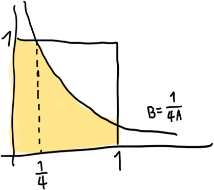

Using quadratic formula, it comes down to:

```math
P(B \leq \dfrac{1}{4A})
```

It will be like getting the area of this:



So

```math
\begin{aligned}
  &\dfrac{1}{4} + \int_{\frac{1}{4}}^{1} \dfrac{1}{4x} dx \\
  &=\dfrac{1}{4} + \dfrac{1}{4} \int_{\frac{1}{4}}^{1} \dfrac{1}{x} dx \\
  &=\dfrac{1}{4} + \dfrac{1}{4} \left(\ln 1 - \ln \frac{1}{4} \right) \\
  &\approx \dfrac{1}{4} + \dfrac{1}{4} \left(0 - (-1.4) \right) \\
  &\approx 0.6
\end{aligned}
```