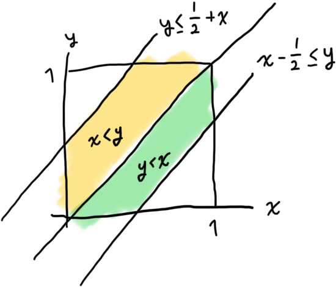
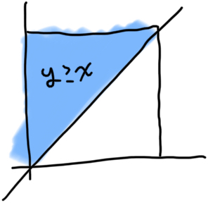

It's easier for an equation with absolute values to express in a piecewise function.

```math
\begin{aligned}
  &|x-y| \leq \frac{1}{2} \\
  &\rightarrow \begin{cases}
    x - \frac{1}{2} \leq y &\text{if } y \leq x \\
    y \leq \frac{1}{2} + x &\text{if } x < y
  \end{cases}
\end{aligned}
```

Putting $`A`$ onto the x-y plane:



Putting $`B`$ onto the x-y plane:

