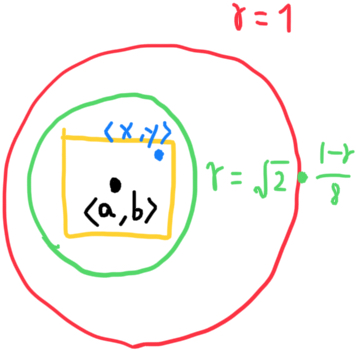

Let's prove that if a point is in the rectangle $`R`$, then it is in disc $`D`$

$`\langle  x,y\rangle  \in R\langle  a,b\rangle`$  
$`\rightarrow a-\dfrac{1-r}{8} <x <a+\dfrac{1-r}{8}`$  
$`\rightarrow -\dfrac{1-r}{8} <x-a <\dfrac{1-r}{8}`$  
$`\rightarrow \left( x-a\right) ^{2} <\left( \dfrac{1-r}{8}\right) ^{2}`$

$`y`$ goes same

$`\rightarrow \left( y-b\right) ^{2} <\left( \dfrac{1-r}{8}\right) ^{2}`$

By adding the two equations we can deduce a definition of slightly bigger circle and it means if point $`\langle x,y \rangle`$ is in $`R`$ then it is in this circle.

$`\rightarrow \left( x-a\right) ^{2}+\left( y-b\right) ^{2} <2\left( \dfrac{1-r}{8}\right) ^{2}`$

Visual representation would roughly be like this

This is triangle inequality from triangle of $`\langle x,y \rangle, \langle a,b \rangle, \langle 0,0 \rangle`$

$`\sqrt{x^{2}+y^{2}} <\sqrt{\left( x-a\right) ^{2}+\left( y-b\right) ^{2}}+\sqrt{a^{2}+b^{2}}`$

We can substitute the part $`\sqrt{\left( x-a\right) ^{2}+\left( y-b\right) ^{2}}`$ with the square-rooted definition of slightly bigger circle because square root is monotonic (order preserving) function.

$`\sqrt{x^{2}+y^{2}} <\sqrt{2\left( \dfrac{1-r}{8}\right) ^{2}}+\sqrt{a^{2}+b^{2}}`$

And we can also substitute $`\sqrt{a^{2}+b^{2}}`$ with $`r`$.

$`\sqrt{x^{2}+y^{2}} <\sqrt{2\left( \dfrac{1-r}{8}\right) ^{2}}+r`$

We can evaluate the right hand or we can just exploit the fact that $`2\left( \dfrac{1-r}{8}\right) ^{2} < (1-r)^2`$

$`\sqrt{x^{2}+y^{2}} <\sqrt{(1-r)^2}+r = 1`$

Hence $`R \subset D`$