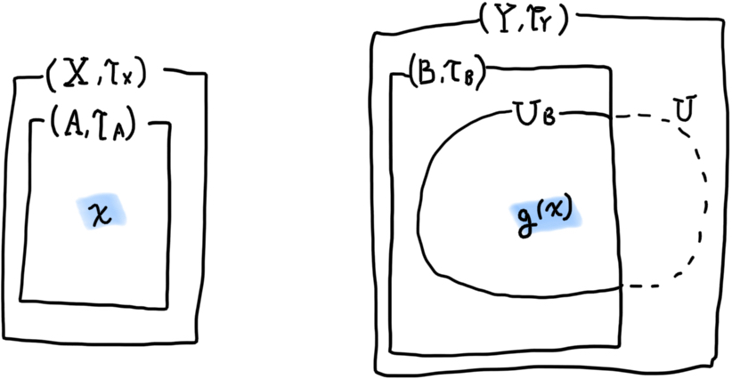
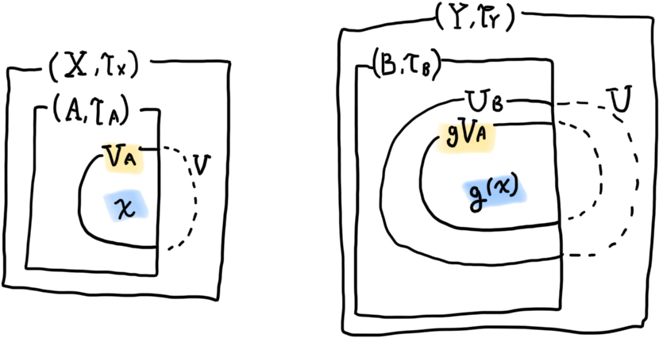

I'll refer $`\mathcal{T}`$ as $`\mathcal{T}_X`$, $`\mathcal{T}_1`$ as $`\mathcal{T}_Y`$, $`\mathcal{T}_2`$ as $`\mathcal{T}_A`$, $`\mathcal{T}_3`$ as $`\mathcal{T}_B`$.

Let's define $`x \in X`$ and $`U \in \mathcal{T}_Y`$ such that $`f(x) \in U`$. By definition of continuous mapping, there must exists a $`V`$ such that $`x \in V \in \mathcal{T}_X`$ and $`f(x) \in fV \subseteq U`$.

If for any $`x \in A`$ and any B-induced open set $`U_B \in \mathcal{T}_B`$, which must imply existance of $`U \in \mathcal{T}_Y`$, such that $`g(x) \in U_B`$,



...there exists an A-induced open set $`V_A`$, which must imply existance of $`V \in \mathcal{T}_A`$, such that the image $`gV_A`$ satisfies $`g(x) \in gV_A \subseteq U_B`$, then $`g`$ must be continuous. What we have to know is that if the image $`gV_A`$is subset of  $`U_B`$, in other words, every $`x \in V_A`$ will satisfiy $`g(x) \in U_B`$. Let's proove it.



```math
\begin{aligned}
    & x \in V_A \\
    & \rightarrow x \in V \\
    & \rightarrow g(x) \in gV \\
    & \rightarrow g(x) \in \text{ some } U & \text{ since } f \text{ is continuous} \\
    & \rightarrow g(x) \in U \cap B & \text{ since codomain of } g \text{ is } B \\
    & \rightarrow g(x) \in U_B
\end{aligned}
```