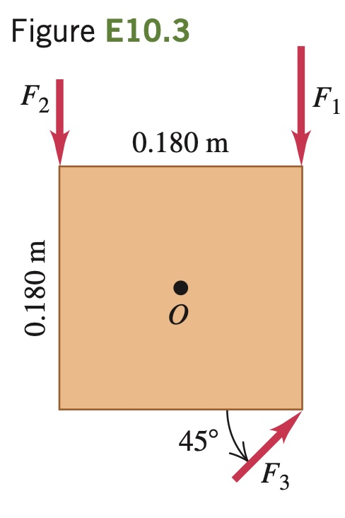

A square metal plate 0.180
m on each side is pivoted about
an axis through point $`O`$ at its cen-
ter and perpendicular to the plate
(Fig. E10.3). Calculate the net torque
about this axis due to the three forces
shown in the figure if the magnitudes of
the forces are $`F_1`$ = 18.0 N, $`F_2`$ = 26.0 N,
and $`F3`$ = 14.0 N. The plate and all forces
are in the plane of the page.
