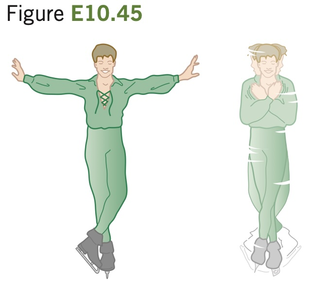

**The Spinning Figure Skater.** The outstretched hands
and arms of a figure skater preparing for a spin can be considered a
slender rod pivoting about an axis
through its center (Fig. E10.45).
When the skater’s hands and arms
are brought in and wrapped around
his body to execute the spin, the
hands and arms can be considered
a thin-walled, hollow cylinder. His
hands and arms have a combined
mass of 8.0 kg. When outstretched, they span 1.8 m; when wrapped,
they form a cylinder of radius 25 cm. The moment of inertia about
the rotation axis of the remainder of his body is constant and equal to 0.40 $`\text{kg} \cdot \text{m}^2`$
. If his original angular speed is 0.40 rev/s, what is his final
angular speed?
