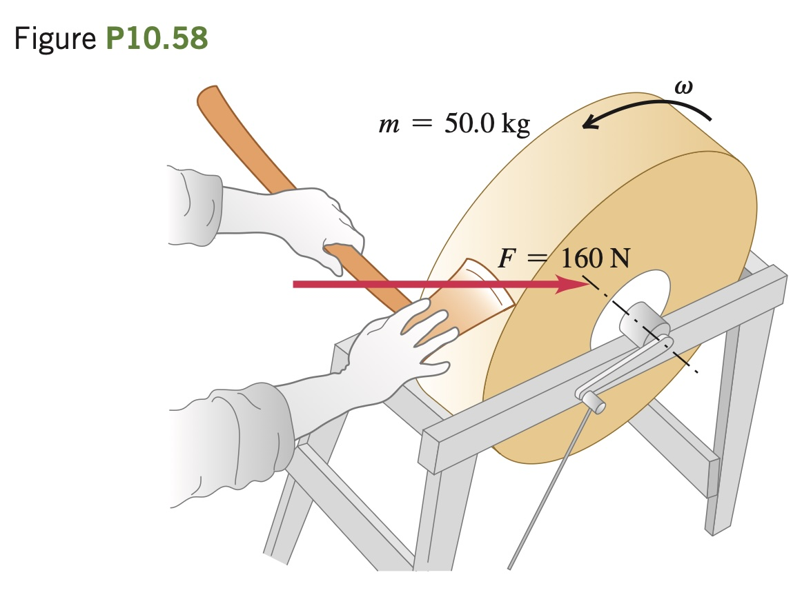

A grindstone in the shape of a solid disk with diameter
0.520 m and a mass of 50.0 kg is rotating at 850 rev>min. You press an
ax against the rim with a normal force of 160 N (Fig. P10.58), and the
grindstone comes to rest in 7.50 s. Find the coefficient of friction be-
tween the ax and the grindstone. You can ignore friction in the bearings.
