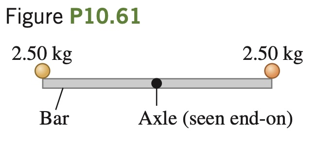

A thin, uniform, 3.80 kg bar, 80.0 cm long, has very small 2.50 kg balls glued on at either end (Fig. P10.61). It is supported horizontally by a thin, horizontal, frictionless axle passing through its center and perpendicular to the bar. Suddenly the right-hand
ball becomes detached and falls off, but the other ball remains glued to
the bar. (a) Find the angular acceleration of the bar just after the ball
falls off. (b) Will the angular acceleration remain constant as the bar
continues to swing? If not, will it increase or decrease? (c) Find the
angular velocity of the bar just as it swings through its vertical position.
