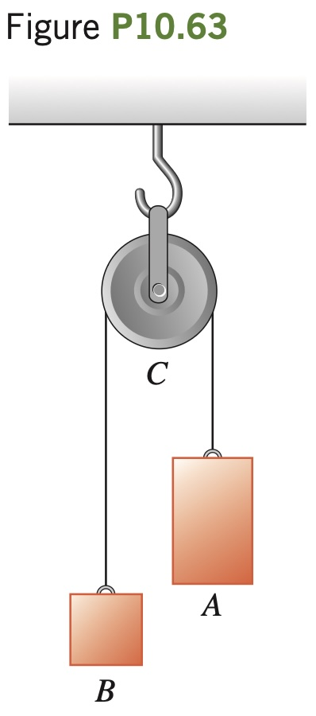

**The Atwood’s Machine.** Figure
P10.63 illustrates an Atwood’s machine. Find
the linear accelerations of blocks A and B, the
angular acceleration of the wheel C, and the
tension in each side of the cord if there is no
slipping between the cord and the surface of the
wheel. Let the masses of blocks A and B be 4.00
kg and 2.00 kg, respectively, the moment of in-
ertia of the wheel about its axis be 0.220 $`\text{kg} \cdot \text{m}^2`$
and the radius of the wheel be 0.120 m.
