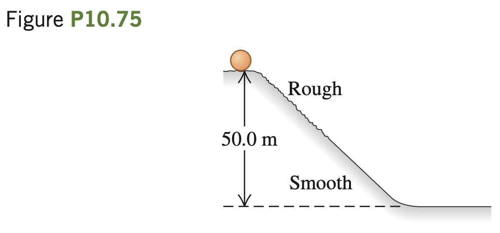

**Rolling Stones.** A solid, uniform, spherical boulder starts
from rest and rolls down a 50.0-m-high hill, as shown in Fig. P10.75.
The top half of the hill is rough enough to cause the boulder to roll
without slipping, but the lower half is covered with ice and there is no
friction. What is the translational speed of the boulder when it reaches
the bottom of the hill? Neglect rolling friction and assume the system’s
total mechanical energy is conserved.
