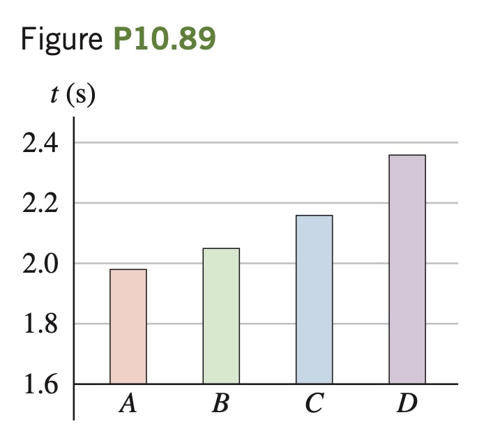

You have one
object of each of these shapes,
all with mass 0.840 kg: a uniform solid cylinder, a thin-walled
hollow cylinder, a uniform solid
sphere, and a thin-walled hollow sphere. You release each
object from rest at the same vertical height h above the bottom
of a long wooden ramp that is
inclined at 35.0° from the horizontal. Each object rolls without
slipping down the ramp. You measure the time t that it takes each one to
reach the bottom of the ramp; Fig. P10.89 shows the results. (a) From
the bar graphs, identify objects A through D by shape. (b) Which of objects A through D has the greatest total kinetic energy at the bottom of
the ramp, or do all have the same kinetic energy? (c) Which of objects A
through D has the greatest rotational kinetic energy $`\frac{1}{2}I \omega^2`$ at the bottom
of the ramp, or do all have the same rotational kinetic energy? (d) What
minimum coefficient of static friction is required for all four objects to
roll without slipping?
