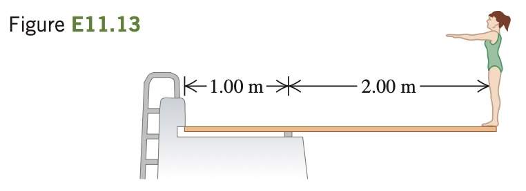

A diving board 3.00 m long is supported at a point 1.00 m from
the end, and a diver weighing 500 N stands at the free end (Fig. E11.13).
The diving board is of uniform cross section and weighs 280 N. Find
(a) the force at the support point and (b) the force at the left-hand end.
