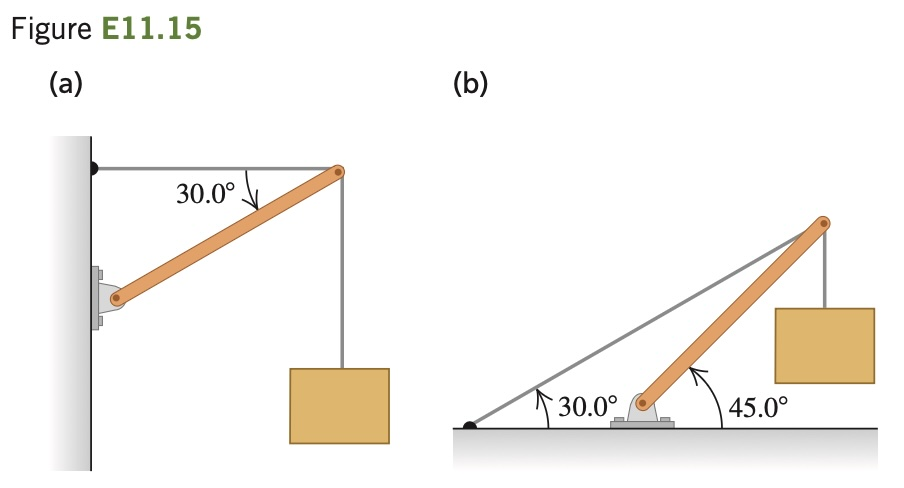

Find the tension T in each cable and the magnitude and
­ direction of the force exerted on the strut by the pivot in each of the arrangements in Fig. E11.15. In each case let w be the weight of the suspended crate full of priceless art objects. The strut is uniform and also
has weight w. Start each case with a free-body diagram of the strut.
