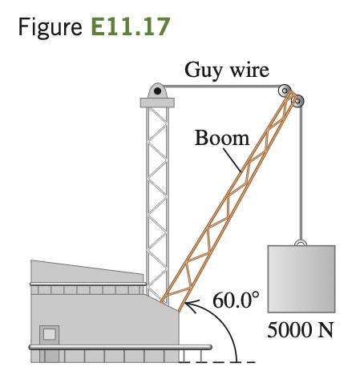

The boom shown in
Fig. E11.17 weighs 2600 N and is
attached to a frictionless pivot at its
lower end. It is not uniform; the distance of its center of gravity from the
pivot is 35% of its length. Find (a)
the tension in the guy wire and (b)
the horizontal and vertical components of the force exerted on the
boom at its lower end. Start with a
free-body diagram of the boom.
