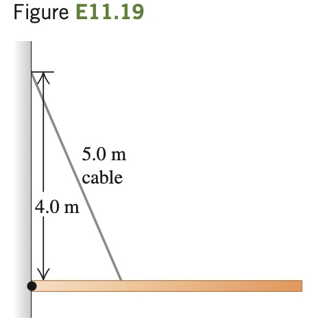

A 9.00-m-long uniform beam is hinged to a vertical wall
and held horizontally by a 5.00-m-
long cable attached to the wall 4.00
m above the hinge (Fig. E11.19).
The metal of this cable has a test
strength of 1.00 kN, which means
that it will break if the tension in
it exceeds that amount. (a) Draw
a free-body diagram of the beam.
(b) What is the heaviest beam that
the cable can support in this configuration? (c) Find the horizontal
and vertical components of the
force the hinge exerts on the beam. Is the vertical component upward
or downward?
