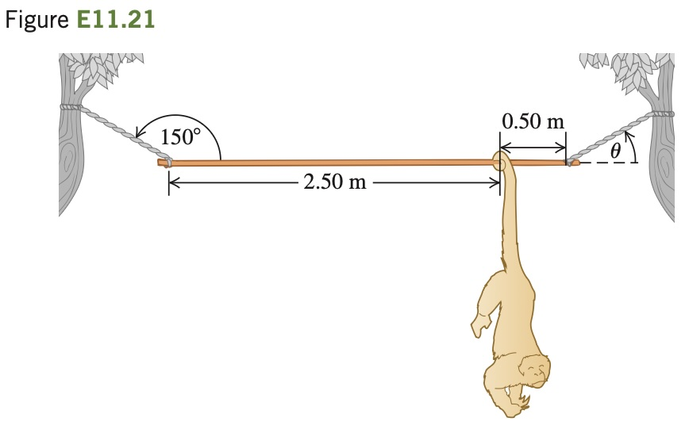

A 3.00-m-long, 190 N, uniform rod at the zoo is held in
a horizontal position by two ropes at its ends (Fig. E11.21). The left
rope makes an angle of 150° with the rod, and the right rope makes an
angle u with the horizontal. A 90 N howler monkey (*Alouatta seniculus*)
hangs motionless 0.50 m from the right end of the rod as he carefully
studies you. Calculate the tensions in the two ropes and the angle u.
First make a free-body diagram of the rod.
