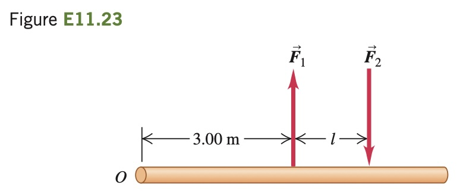

**A Couple.** Two forces equal in magnitude and opposite
in direction, acting on an object at two different points, form what
is called a *couple*. Two antiparallel forces with equal magnitudes $`F_1 = F_2 = 8.00 \text{N}`$ are applied to a rod as shown in **Fig. E11.23.**
(a) What should the distance l between the forces be if they are to provide a net torque of $`6.40 \text{N} \cdot \text{m}`$ about the left end of the rod? (b) Is the
sense of this torque clockwise or counterclockwise? (c) Repeat parts
(a) and (b) for a pivot at the point on the rod where $`\vec{F_2}`$ is applied.

