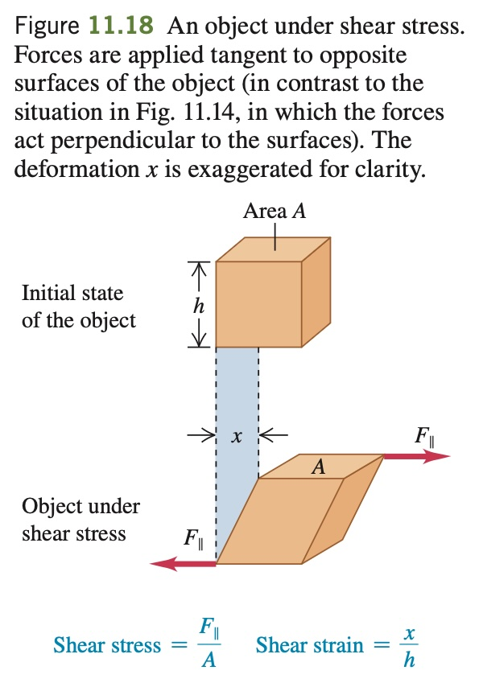

A square steel plate is 10.0 cm on a side and 0.500 cm thick.
(a) Find the shear strain that results if two forces, each of magnitude $`9.0 \times 10^5`$ N and in opposite directions, act tangent to the surfaces of a
pair of opposite sides of the object,
as in Fig. E11.18. (b) Find the displacement x in centimeters.
