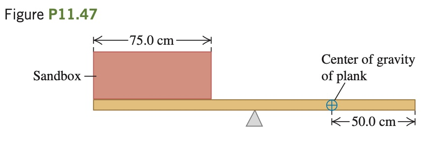

A box of negligible mass rests at the left end of a 2.00 m,
25.0 kg plank (**Fig. P11.47**). The width of the box is 75.0 cm, and sand
is to be distributed uniformly throughout it. The center of gravity of the
nonuniform plank is 50.0 cm from the right end. What mass of sand
should be put into the box so that the plank balances horizontally on a
fulcrum placed just below its midpoint?
