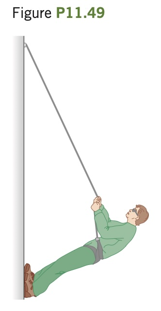

Mountain Climbing. Mountaineers
often use a rope to lower themselves
down the face of a cliff (this is called rappelling). They do this with their body nearly horizontal and their feet pushing against the cliff
(**Fig. P11.49**). Suppose that an 82.0 kg climber,
who is 1.90 m tall and has a center of gravity
1.1 m from his feet, rappels down a vertical
cliff with his body raised 35.0° above the horizontal. He holds the rope 1.40 m from his feet,
and it makes a 25.0° angle with the cliff face.
(a) What tension does his rope need to support?
(b) Find the horizontal and vertical components
of the force that the cliff face exerts on the
climber’s feet. (c) What minimum coefficient
of static friction is needed to prevent the climber’s feet from slipping on the cliff face if he has
one foot at a time against the cliff?

