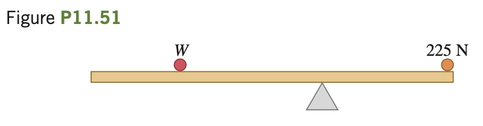

A uniform, 255 N rod
that is 2.00 m long carries a 225 N
weight at its right end and an unknown weight W toward the left end
(**Fig. P11.51**). When W is placed 50.0 cm from the left end of the rod,
the system just balances horizontally when the fulcrum is located 75.0
cm from the right end. (a) Find W. (b) If W is now moved 25.0 cm to
the right, how far and in what direction must the fulcrum be moved to
restore balance?

