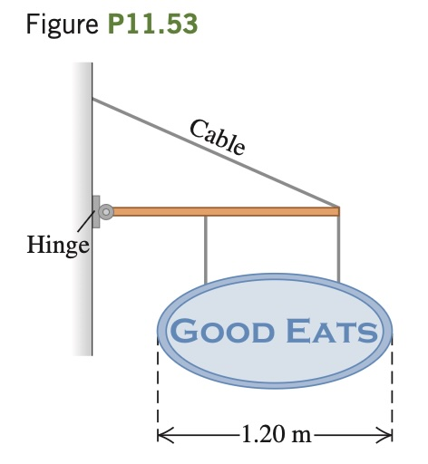

You open a restaurant and hope to entice customers by hanging out a sign (**Fig. P11.53**). The uniform horizontal beam supporting the sign is 1.50 m long, has
a mass of 16.0 kg, and is hinged
to the wall. The sign itself is uniform with a mass of 28.0 kg and
overall length of 1.20 m. The two
wires supporting the sign are each
32.0 cm long, are 90.0 cm apart,
and are equally spaced from the
middle of the sign. The cable supporting the beam is 2.00 m long.
(a) What minimum tension must
your cable be able to support without having your sign come crashing
down? (b) What minimum vertical force must the hinge be able to sup-
port without pulling out of the wall?

