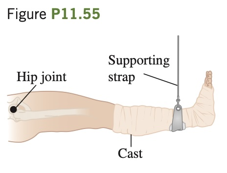

BIO **Supporting a Broken Leg.** A therapist tells a 74 kg patient with a broken leg
that he must have his leg in a cast
suspended horizontally. For minimum discomfort, the leg should
be supported by a vertical strap attached at the center of mass of the leg–cast system (**Fig. P11.55**). To comply with these instructions,
the patient consults a table of typical mass distributions and finds that
both upper legs (thighs) together typically account for 21.5% of body
weight and the center of mass of each thigh is 18.0 cm from the hip
joint. The patient also reads that the two lower legs (including the feet)
are 14.0% of body weight, with a center of mass 69.0 cm from the hip
joint. The cast has a mass of 5.50 kg, and its center of mass is 78.0 cm
from the hip joint. How far from the hip joint should the supporting
strap be attached to the cast?

