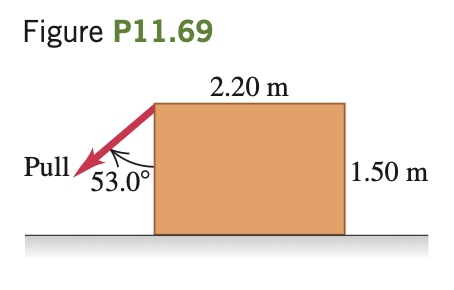

A worker wants to turn
over a uniform, 1250 N, rectangular
crate by pulling at 53.0° on one of
its vertical sides (**Fig. P11.69**). The
floor is rough enough to ­ prevent
the crate from slipping. (a) What
pull is needed to just start the
crate to tip? (b) How hard does the
floor push upward on the crate? (c) Find the friction force on the crate.
(d) What is the minimum coefficient of static friction needed to prevent
the crate from slipping on the floor?
