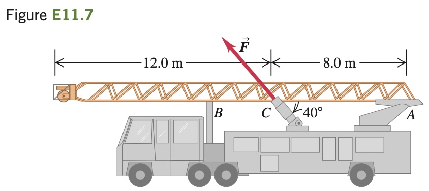

**Raising a Ladder.** A ladder carried by a fire truck is 20.0 m
long. The ladder weighs 3400 N and its center of gravity is at its center.
The ladder is pivoted at one end (A) about a pin (Fig. E11.7); ignore
the friction torque at the pin. The ladder is raised into position by a
force applied by a hydraulic piston at C. Point C is 8.0 m from A, and
the force $`\vec{F}`$ exerted by the piston makes an angle of 40° with the ladder. What magnitude must $`\vec{F}`$ have to just lift the ladder off the support
bracket at B? Start with a free-body diagram of the ladder.
