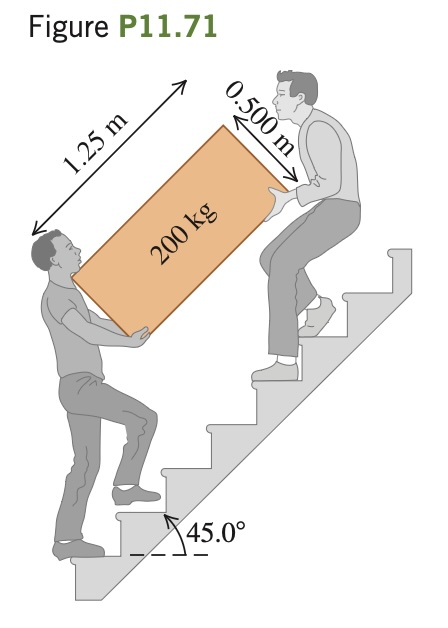

Two friends are carrying a 200 kg crate up a flight of stairs. The crate is 1.25 m long and 0.500 m high, and its center of gravity is at its center. The stairs make a 45.0° angle with respect to the floor. The crate also is carried at a 45.0° angle, so that its bottom side is parallel to the slope of the stairs (**Fig. P11.71**). If the force each person applies is
vertical, what is the magnitude of
each of these forces? Is it better to
be the person above or below on the
stairs?
