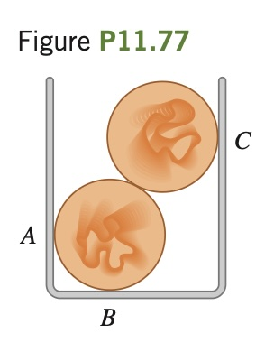

Two uniform, 75.0 g marbles
2.00 cm in diameter are stacked as shown
in Fig. P11.77 in a container that is 3.00 cm
wide. (a) Find the force that the container exerts on the marbles at the points of contact A,
B, and C. (b) What force does each marble
exert on the other?

