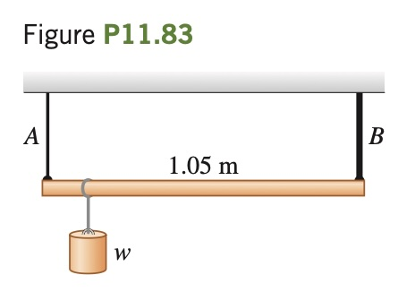

A 1.05-m-long rod of negligible weight is supported at its ends by wires $`A`$ and $`B`$ of equal length (Fig. P11.83). The cross-sectional area of $`A`$ is $`2.00 \text{ mm}^2`$ and that of $`B`$ is $`4.00 \text{ mm}^2`$. Young's modulus for wire $`A`$ is $`1.80 \times 10^{11} \text{ Pa}`$; that for $`B`$ is $`1.20 \times 10^{11} \text{ Pa}`$. At what point along the rod should a weight $`w`$ be suspended to produce (a) equal stresses in $`A`$ and $`B`$ and (b) equal strains in $`A`$ and $`B`$?

