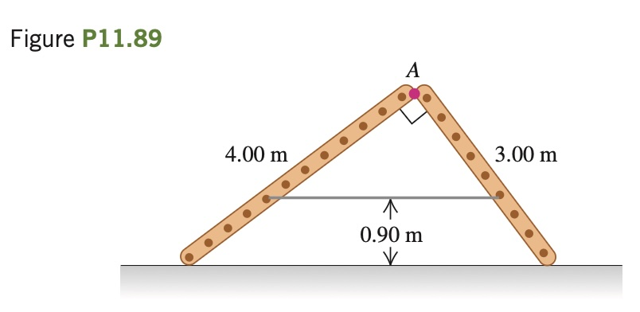

Two ladders, 4.00 m and 3.00 m long, are hinged at
point *A* and tied together by a horizontal rope 0.90 m above the floor
**(Fig. P11.89)**. The ladders weigh 480 N and 360 N, respectively, and
the center of gravity of each is at its center. Assume that the floor is
freshly waxed and frictionless. (a) Find the upward force at the bottom
of each ladder. (b) Find the tension in the rope. (c) Find the magnitude
of the force one ladder exerts on the other at point *A*. (d) If an 800 N
painter stands at point *A*, find the tension in the horizontal rope.

