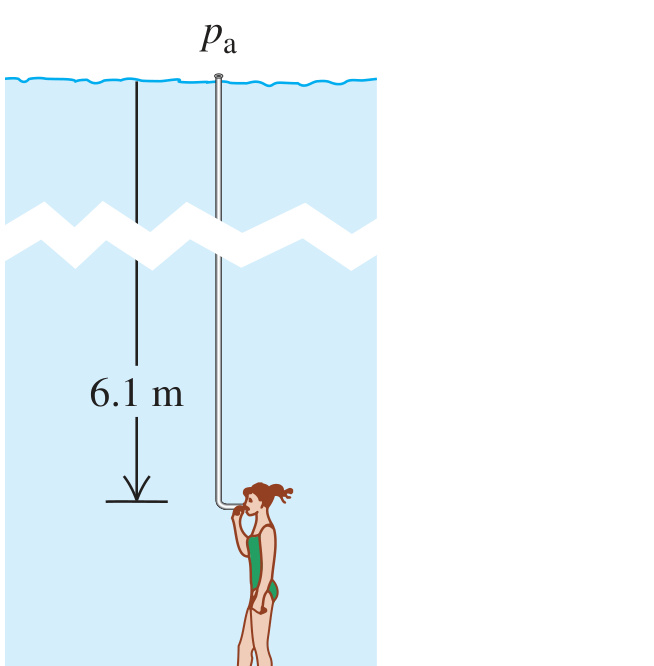

**BIO** There is a maximum depth at which a diver can breathe through a snorkel tube (Fig. E12.15) because as the depth increases, so does the pressure difference, which tends to collapse the diver's lungs. Since the snorkel connects the air in the lungs to the atmosphere at the surface, the pressure inside the lungs is atmospheric pressure. What is the external–internal pressure difference when the diver's lungs are at a depth of 6.1 m (about 20 ft)? Assume that the diver is in freshwater. (A scuba diver breathing from compressed air tanks can operate at greater depths than can a snorkeler, since the pressure of the air inside the scuba diver's lungs increases to match the external pressure of the water.)

