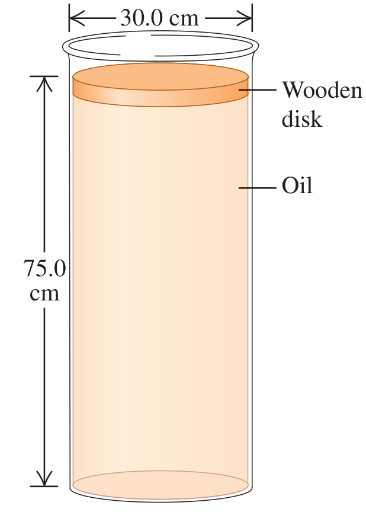

A cylindrical disk of wood weighing 45.0 N and having a diameter of 30.0 cm floats on a cylinder of oil of density $`0.850 \ \text{g/cm}^3`$ (Fig. E12.19). The cylinder of oil is 75.0 cm deep and has a diameter the same as that of the wood. (a) What is the gauge pressure at the top of the oil column? (b) Suppose now that someone puts a weight of 83.0 N on top of the wood, but no oil seeps around the edge of the wood. What is the change in pressure at (i) the bottom of the oil and (ii) halfway down in the oil?

