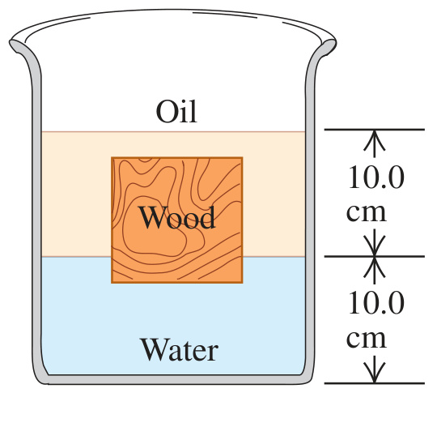

A cubical block of wood, 10.0 cm on a side, floats at the interface between oil and water with its lower surface 1.50 cm below the interface (Fig. E12.33). The density of the oil is $`790 \ \text{kg/m}^3`$. (a) What is the gauge pressure at the upper face of the block? (b) What is the gauge pressure at the lower face of the block? (c) What are the mass and density of the block?

