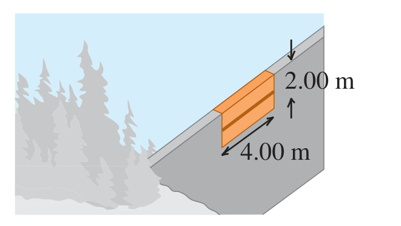

**CP CALC** The upper edge of a gate in a dam runs along the water surface. The gate is 2.00 m high and 4.00 m wide and is hinged along a horizontal line through its center (Fig. P12.57). Calculate the torque about the hinge arising from the force due to the water. (*Hint:* Use a procedure similar to that used in Problem 12.55; calculate the torque on a thin, horizontal strip at a depth $`h`$ and integrate this over the gate.)

