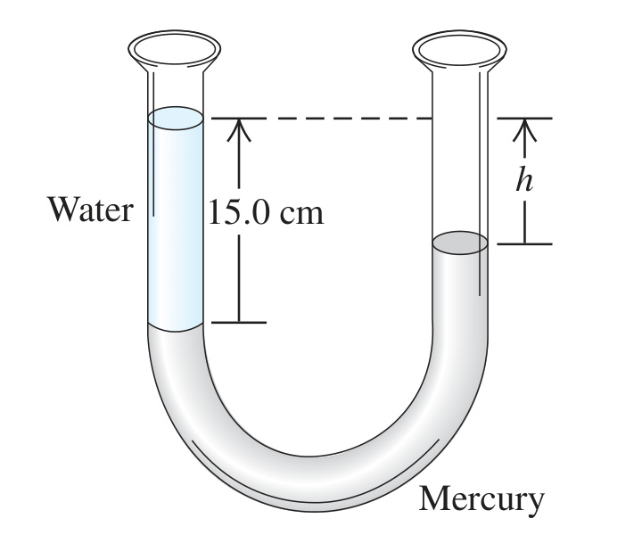

A U-shaped tube open to the air at both ends contains some mercury. A quantity of water is carefully poured into the left arm of the U-shaped tube until the vertical height of the water column is 15.0 cm (Fig. P12.63). (a) What is the gauge pressure at the water–mercury interface? (b) Calculate the vertical distance $`h`$ from the top of the mercury in the right-hand arm of the tube to the top of the water in the left-hand arm.

