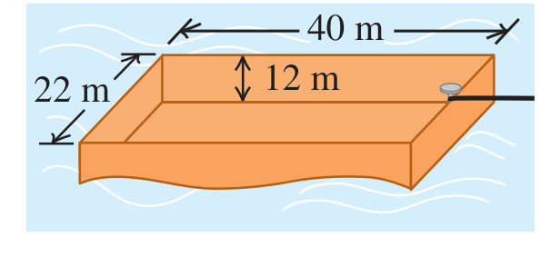

An open barge has the dimensions shown in Fig. P12.67. If the barge is made out of 4.0-cm-thick steel plate on each of its four sides and its bottom, what mass of coal can the barge carry in freshwater without sinking? Is there enough room in the barge to hold this amount of coal? (The density of coal is about $`1500 \ \text{kg/m}^3`$.)

