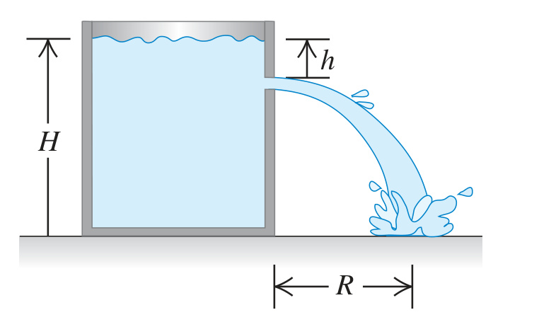

**CP** Water stands at a depth $`H`$ in a large, open tank whose side walls are vertical (Fig. P12.77). A hole is made in one of the walls at a depth $`h`$ below the water surface. (a) At what distance $`R`$ from the foot of the wall does the emerging stream strike the floor? (b) How far above the bottom of the tank could a second hole be cut so that the stream emerging from it could have the same range as for the first hole?

