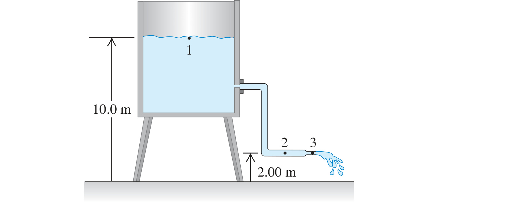

Water flows steadily from an open tank as in Fig. P12.81. The elevation of point 1 is 10.0 m, and the elevation of points 2 and 3 is 2.00 m. The cross-sectional area at point 2 is $`0.0480 \ \text{m}^2`$; at point 3 it is $`0.0160 \ \text{m}^2`$. The area of the tank is very large compared with the cross-sectional area of the pipe. Assuming that Bernoulli's equation applies, compute (a) the discharge rate in cubic meters per second and (b) the gauge pressure at point 2.

