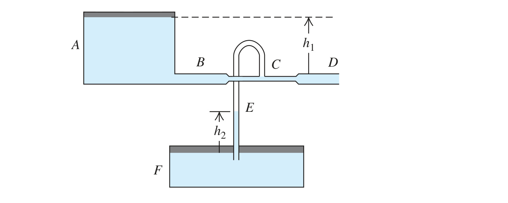

Two very large open tanks $`A`$ and $`F`$ (Fig. P12.83) contain the same liquid. A horizontal pipe $`BCD`$, having a constriction at $`C`$ and open to the air at $`D`$, leads out of the bottom of tank $`A`$, and a vertical pipe $`E`$ opens into the constriction at $`C`$ and dips into the liquid in tank $`F`$. Assume streamline flow and no viscosity. If the cross-sectional area at $`C`$ is one-half the area at $`D`$ and if $`D`$ is a distance $`h_1`$ below the level of the liquid in $`A`$, to what height $`h_2`$ will liquid rise in pipe $`E`$? Express your answer in terms of $`h_1`$.

