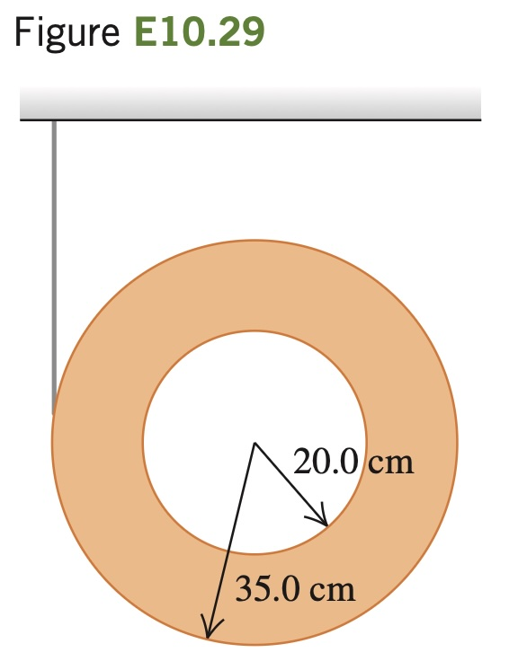

A thin, light string is wrapped around the outer rim of a uniform hollow cylinder of mass 4.75 kg having inner and outer radii as shown in Fig. E10.29. The cylinder is then released from rest. (a) How far must the cylinder fall before its center is moving at 6.66 m/s? (b) If you just dropped this cylinder without any string, how fast would its center be moving when it had fallen the ­distance in part (a)? (c) Why do you get two different answers when the cylinder falls the same distance in both cases?

