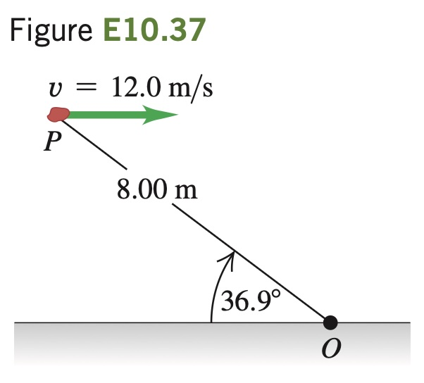

A 2.00 kg rock has a horizontal velocity of magnitude 12.0 m/s when it is at point P in Fig. E10.37. (a) At this instant, what are the magnitude and direction of its
angular momentum relative to point
O? (b) If the only force acting on the
rock is its weight, what is the rate of
change (magnitude and direction) of
its angular momentum at this instant?
