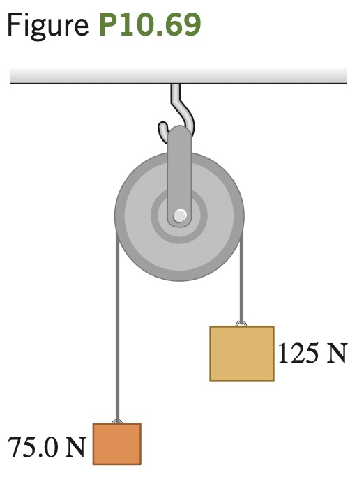

Two weights are connected by a very light, flexible cord that passes
over an 80.0 N frictionless pulley of ra-
dius 0.300 m. The pulley is a solid uni-
form disk and is supported by a hook
connected to the ceiling (Fig. P10.69).
What force does the ceiling exert on the
hook?
