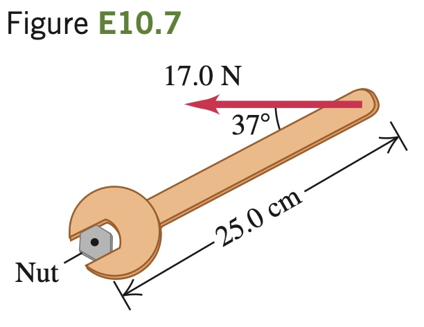

A machinist is using a wrench
to loosen a nut. The wrench is 25.0 cm
long, and he exerts a 17.0 N force at
the end of the handle at 37° with the
handle (Fig. E10.7). (a) What torque
does the machinist exert about the
center of the nut? (b) What is the
maximum torque he could exert with
a force of this ­ magnitude, and how
should the force be oriented?

