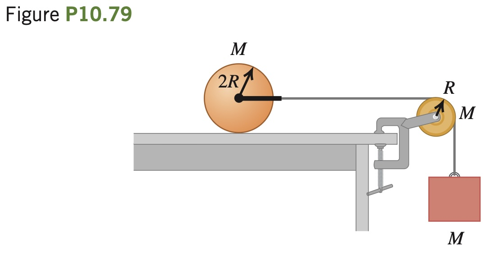

A uniform solid cylinder with mass M and radius 2R rests on
a horizontal tabletop. A string is attached by a yoke to a frictionless axle
through the center of the cylinder so that the cylinder can rotate about
the axle. The string runs over a disk-shaped pulley with mass M and ra-
dius R that is mounted on a frictionless axle through its center. A block
of mass M is suspended from the free end of the string (Fig. P10.79).
The string doesn’t slip over the pulley surface, and the cylinder rolls
without slipping on the tabletop. Find the magnitude of the acceleration
of the block after the system is released from rest.
